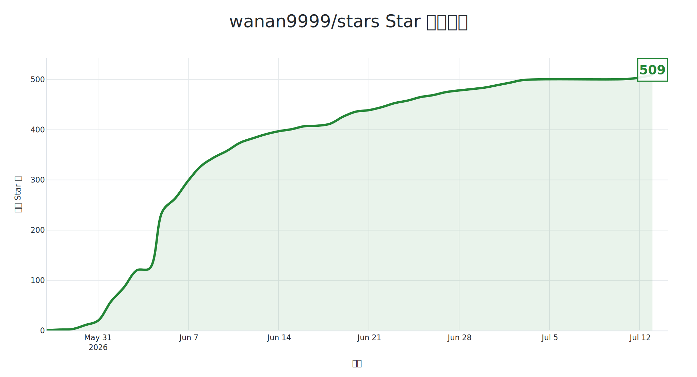

# GitHub Star History Chart

为 GitHub 仓库生成 Star 增长趋势图，并**默认自动追加到 README.md 末尾**以 Markdown 形式渲染展示。

## 功能

- 通过 GitHub API 拉取项目完整 Star 历史
- 生成 1200×650 趋势图，支持 **SVG / PNG 二选一**（默认 SVG）
- 支持中文 / 英文图表
- **默认**将图表写入 `README.md` 末尾并自动 git commit + push
- 重复运行时会替换已有图表区块，不会无限追加

## 快速使用

### 1. 配置 PAT（必需）

自 **2026-07** 起，GitHub 限制 stargazers 接口仅 **仓库管理员/协作者的用户 PAT** 可访问，`GITHUB_TOKEN`也不行，

1. 创建 [Personal Access Token](https://github.com/settings/tokens)（Classic 选 `public_repo` 或 `repo` 权限）
2. 在仓库 **Settings → Secrets → Actions** 中添加 Secret：`GH_PAT`

### 2. Workflow 示例

### Workflow 示例见：[examples/consumer-workflow.yml](examples/consumer-workflow.yml)

Action 会生成仓库根目录下的 `stars.svg`（或 `stars.png`），并在 README 末尾追加：

```markdown
<!-- star-history-chart:start -->

<!-- star-history-chart:end -->
```

自定义输出路径示例：

```yaml
- uses: wanan9999/stars@v1
  with:
    owner: ${{ github.repository_owner }}
    repo: ${{ github.event.repository.name }}
    token: ${{ secrets.GH_PAT }}
    image-format: png
    output-dir: ./assets
    filename: star-chart.png
```

## Inputs

| 参数 | 必填 | 默认值 | 说明 |
|------|------|--------|------|
| `owner` | 是 | — | 仓库所有者 |
| `repo` | 是 | — | 仓库名称 |
| `token` | **是** | — | 仓库管理员/协作者的 PAT（`GH_PAT`），不可用 `GITHUB_TOKEN` |
| `language` | 否 | `zh` | 图表语言：`zh` / `en` |
| `image-format` | 否 | `svg` | 输出格式：`svg` / `png` |
| `output-dir` | 否 | `.` | 图表输出目录（默认仓库根目录） |
| `filename` | 否 | `stars.{format}` | 输出文件名，如 `stars.svg` |
| `readme-path` | 否 | `README.md` | 要更新的 README 路径 |
| `commit-to-readme` | 否 | `true` | 是否写入 README 并提交 |
| `commit-message` | 否 | `docs: update star history chart` | Git 提交信息 |

## Outputs

| 输出 | 说明 |
|------|------|
| `image-path` | 生成的图表文件路径 |
| `image-format` | 图表格式（`svg` 或 `png`） |
| `total-stars` | 当前 Star 总数 |

## Token 说明

- **必须使用 PAT**：stargazers 接口不接受 Actions 内置的 `GITHUB_TOKEN`（integration token）
- PAT 所属用户必须是目标仓库的**管理员或协作者**
- 公开仓库：Classic PAT 需 `public_repo` 权限
- 私有仓库：Classic PAT 需 `repo` 权限
- 查其他仓库：PAT 用户同样需是该仓库 admin/collaborator

## 项目结构

```
stars/
├── action.yml              # Composite Action 定义
├── action/main.py          # 核心逻辑
├── requirements.txt
├── app.py                  # 本地 CLI 入口
├── examples/               # 用户 Workflow 示例
└── .github/workflows/      # 自测与 Reusable Workflow
```
